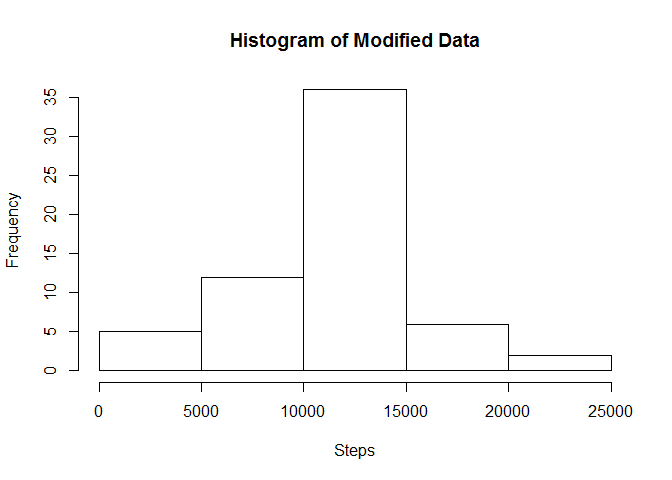

## Loading and Processing the Data

First, we must read the data from the current directory.
Then, we process the data into a format that is convenient for manipulation.


```r
data <- read.csv("./activity.csv")
data <- data.frame(data)
```


## What is the mean total number or steps taken each day?

For this part of the assignment, NA values are ignored.
Here, we find the total number of steps taken each day


```r
agg <- aggregate(data$steps, by=list(Category=data$date),FUN=sum)
agg
```

```
##      Category     x
## 1  2012-10-01    NA
## 2  2012-10-02   126
## 3  2012-10-03 11352
## 4  2012-10-04 12116
## 5  2012-10-05 13294
## 6  2012-10-06 15420
## 7  2012-10-07 11015
## 8  2012-10-08    NA
## 9  2012-10-09 12811
## 10 2012-10-10  9900
## 11 2012-10-11 10304
## 12 2012-10-12 17382
## 13 2012-10-13 12426
## 14 2012-10-14 15098
## 15 2012-10-15 10139
## 16 2012-10-16 15084
## 17 2012-10-17 13452
## 18 2012-10-18 10056
## 19 2012-10-19 11829
## 20 2012-10-20 10395
## 21 2012-10-21  8821
## 22 2012-10-22 13460
## 23 2012-10-23  8918
## 24 2012-10-24  8355
## 25 2012-10-25  2492
## 26 2012-10-26  6778
## 27 2012-10-27 10119
## 28 2012-10-28 11458
## 29 2012-10-29  5018
## 30 2012-10-30  9819
## 31 2012-10-31 15414
## 32 2012-11-01    NA
## 33 2012-11-02 10600
## 34 2012-11-03 10571
## 35 2012-11-04    NA
## 36 2012-11-05 10439
## 37 2012-11-06  8334
## 38 2012-11-07 12883
## 39 2012-11-08  3219
## 40 2012-11-09    NA
## 41 2012-11-10    NA
## 42 2012-11-11 12608
## 43 2012-11-12 10765
## 44 2012-11-13  7336
## 45 2012-11-14    NA
## 46 2012-11-15    41
## 47 2012-11-16  5441
## 48 2012-11-17 14339
## 49 2012-11-18 15110
## 50 2012-11-19  8841
## 51 2012-11-20  4472
## 52 2012-11-21 12787
## 53 2012-11-22 20427
## 54 2012-11-23 21194
## 55 2012-11-24 14478
## 56 2012-11-25 11834
## 57 2012-11-26 11162
## 58 2012-11-27 13646
## 59 2012-11-28 10183
## 60 2012-11-29  7047
## 61 2012-11-30    NA
```

Then, we create a histogram of the total number of steps taken each day


```r
hist(agg$x,xlab="Steps")
```

<!-- -->

We then calculate the mean and median of total number of steps each day


```r
mean <- mean(agg$x, na.rm=TRUE)
median <- median(agg$x, na.rm=TRUE)
mean
```

```
## [1] 10766.19
```

```r
median
```

```
## [1] 10765
```

## What is the daily activity pattern?

We first aggregate the data by time interval through the mean function.
Then, we can plot the time series plot of the aggregate to see daily activity.


```r
aggint <- aggregate(data$steps, by=list(Interval=data$interval), FUN=mean, na.rm=TRUE)
plot.ts(aggint$Interval, aggint$x, type="l", xlab="Time Interval", ylab = "Average Steps")
```

<!-- -->

Next, we find which interval has the highest average number of steps.


```r
avgmax <- aggint[which.max(aggint$x),]
avgmax
```

```
##     Interval        x
## 104      835 206.1698
```

## Imputing missing values

We first determine how many missing values of Steps are in the dataset.


```r
totalmissing <- sum(is.na(data$steps))
totalmissing
```

```
## [1] 2304
```

I chose to replace na values with the average step across all intervals in a day
The updated data frame is input into the data frame 'fulldata'


```r
avgintsteps <- mean(aggint$x)
fulldata <- data
fulldata$steps[is.na(fulldata$steps)] <- avgintsteps
```

Next we llot the histogram of the full data, and the find it's mean and median


```r
fullagg <- aggregate(fulldata$steps, by=list(Category=fulldata$date),FUN=sum)
hist(fullagg$x, xlab="Steps", main="Histogram of Modified Data")
```

<!-- -->

```r
fullmean <- mean(fullagg$x)
fullmedian <- median(fullagg$x)
fullmean
```

```
## [1] 10766.19
```

```r
fullmedian
```

```
## [1] 10766.19
```

Comparing to the median and mean values of the NA present dataset,
Since NA values were replaced by the mean value with our estimation, the median 
value shifted and matched the mean value. 

## Are there differences in activity patterns between weekdays and weekends?

First, to find the weekdays of the date, we must convert the class of the date


```r
fulldata$date <- as.Date(fulldata$date,format="%Y-%m-%d")
```

We then convert the date in the dataset to weekdays in a new dataset


```r
weekdaydata <- fulldata
weekdaydata$date <- weekdays(weekdaydata$date)
```

We select the days by weekdays to sort the days as weekdays or weekends.


```r
weekdays <- c("Monday", "Tuesday", "Wednesday", "Thursday", "Friday")
weekdaydata$days <- factor(weekdaydata$date %in% weekdays, levels = c(TRUE, FALSE), labels = c("weekday", "weekend"))
```

We split the data into weekday and weekend data to plot seperately
and take their aggregate.


```r
weekday <- weekdaydata[which(weekdaydata$days=="weekday"),]
weekend <- weekdaydata[which(weekdaydata$days=="weekend"),]
aggwkday <- aggregate(weekday$steps, by=list(Interval=weekday$interval), FUN=mean)
aggwkend <- aggregate(weekend$steps, by=list(Interval=weekend$interval), FUN=mean)
```

Lastly, we plot the weekday and weekend data together.


```r
par(mfrow=c(2,1))
plot(aggwkday$Interval, aggwkday$x, ylab = "Steps", xlab = "Interval", main= "Weekday Steps", type="l")
plot(aggwkend$Interval, aggwkend$x, ylab = "Steps", xlab = "Interval", main= "Weekend Steps", type="l")
```

<!-- -->

Thus, all steps for this assignment is complete.
